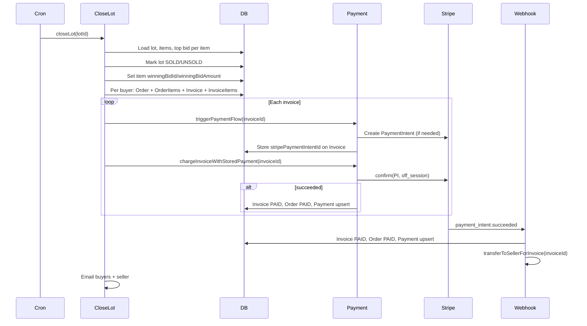

# Review: Auction soft close, order creation, invoice generation, and Stripe auto-charge

## 1. Soft close logic

**Where:** [src/actions/bid.action.ts](src/actions/bid.action.ts) (place bid)

**Behavior:**

- When a bid is placed, the code checks whether the lot is in the “soft close window” and under the extend limit.
- **Window:** `remainingSeconds = (lot.closesAt - now) / 1000`; if `remainingSeconds <= softCloseWindowSec` (default 120), the lot is in the window.
- **Limit:** `lot.extendedCount < softCloseExtendLimit` (default 10).
- **Extension:** If the auction has `softCloseEnabled` (default true) and both conditions above hold, `closesAt` is extended by `softCloseExtendSec` (default 60) and `extendedCount` is incremented.
- Auction settings come from `item.lot.auction` (softCloseEnabled, softCloseWindowSec, softCloseExtendSec, softCloseExtendLimit). If the lot has **no auction**, `auction` is null and the code uses defaults: `softCloseEnabled ?? true`, `softCloseWindowSec ?? 120`, etc., so standalone lots still get soft close.
- All updates (bid create, item `currentPrice`, optional lot `closesAt` + `extendedCount` + `lastExtendedAt`) run in a **single Prisma transaction**, so extensions are consistent with the bid.

**Schema:** Lot has `extendedCount`, `lastExtendedAt`; Auction has the four soft-close fields. Admin configures them in [AuctionForm](src/app/components/admin/AuctionForm.tsx).

---

## 2. Lot close trigger (cron)

**Where:** [src/app/api/cron/close-lots/route.ts](src/app/api/cron/close-lots/route.ts) → [src/actions/close-expired-lots.action.ts](src/actions/close-expired-lots.action.ts)

**Behavior:**

- Cron (e.g. every minute via `vercel.json`) calls `closeExpiredLots()`.
- Finds lots with `status: "LIVE"` and `closesAt <= now`.
- Because soft close can extend `closesAt`, a lot is only closed after its (possibly extended) close time has passed.
- For each such lot, `closeLot(lot.id)` is called; errors are collected and returned.

---

## 3. Order creation and invoice generation

**Where:** [src/actions/close-lot.action.ts](src/actions/close-lot.action.ts) (`closeLot`)

**Flow (high level):**

**Order creation (same file, inside transaction):**

- Winning bid per item: `item.bids[0]` with `orderBy: { amount: "desc" }, take: 1`. Bid model has `userId`; no extra `include` needed for `buyerId`.
- `wonItems` is grouped by `buyerId`; one **Order** per (buyer, lot) with `status: "PENDING"`, and one **OrderItem** per won item (subtotal, buyerPremium, tax, total).
- Buyer premium %: parsed from `lot.auction?.buyersPremium` via `parseBuyerPremiumPct` (e.g. `"12%"` → 12). If no auction, premium is 0.
- One **Invoice** per order: `invoiceDisplayId`, `orderId`, `buyerId`, `sellerId`, `lotId`, `winningBidAmount`, `buyerPremiumPct`, `tax`, `invoiceTotal`, `status: "PENDING"`. **InvoiceItems** link invoice to each won item. No Stripe PaymentIntent is created inside the DB transaction.

---

## 4. Auto-charge to card attached to Stripe

**Where:** [src/actions/payment.action.ts](src/actions/payment.action.ts) and [src/app/api/stripe/webhook/route.ts](src/app/api/stripe/webhook/route.ts)

**Steps:**

1. **triggerPaymentFlow(invoiceId)**
  - Creates a Stripe **PaymentIntent** for `invoice.invoiceTotal` (USD), `customer: buyer.stripeCustomerId`, `metadata: { invoiceId }`, `automatic_payment_methods: { enabled: true }`.  
  - Saves `stripePaymentIntentId` on the Invoice.  
  - Minimum amount 50 cents; below that returns an error and no PI is created.
2. **chargeInvoiceWithStoredPayment(invoiceId)**
  - Ensures a PaymentIntent exists (calls `triggerPaymentFlow` if needed).  
  - Retrieves buyer’s Stripe customer and lists **card** payment methods; uses the first card (Stripe does not guarantee “default” order; the code assumes the first is the one to charge).  
  - Calls `stripe.paymentIntents.confirm(paymentIntentId, { payment_method: pmId, off_session: true })`.  
  - If `pi.status === "succeeded"`: in a single transaction, updates **Invoice** (status PAID, paidAt), **Order** (status PAID), and **Payment** (upsert by orderId, provider STRIPE, providerRef, amount, status PAID).  
  - Seller payout is **not** done here; comment states it is done in the webhook to avoid double transfer.
3. **Webhook `payment_intent.succeeded**`
  - Uses `metadata.invoiceId`; loads Invoice and Order.  
  - Performs the **same** Invoice/Order/Payment updates (idempotent).  
  - Then calls **transferToSellerForInvoice(invoiceId)** for the seller payout (Stripe Connect transfer).  
  - So the **only** place seller transfer runs is the webhook.

**Risks / notes:**

- **Double DB update:** Both the synchronous `chargeInvoiceWithStoredPayment` and the async webhook update Invoice/Order/Payment. This is redundant but idempotent. If the webhook never fires (e.g. delivery failure), the buyer is charged and order marked PAID in our DB, but **seller transfer might never run**; monitoring and idempotent retries for the webhook are important.
- **Card choice:** Using `paymentMethods.list(..., type: "card")` and `data[0]` does not guarantee the “default” or “preferred” card; it depends on Stripe’s list order. If you need a specific default, you’d use the customer’s `invoice_settings.default_payment_method` (as in `setDefaultPaymentMethodFromSetupIntent`) and ensure that is the one used for `chargeInvoiceWithStoredPayment`.
- **Requires action:** If `confirm` returns `requires_action` (e.g. 3DS), the code does not redirect the buyer; the invoice stays PENDING and the buyer must pay later (e.g. from the orders page).

---

## 5. Summary table

| Area                       | Location                                                                 | Status / note                                                                                 |
| -------------------------- | ------------------------------------------------------------------------ | --------------------------------------------------------------------------------------------- |
| Soft close (extend on bid) | [bid.action.ts](src/actions/bid.action.ts)                               | Implemented; per-auction params; defaults when lot has no auction.                            |
| Cron (expired lots)        | [close-expired-lots.action.ts](src/actions/close-expired-lots.action.ts) | Uses `closesAt <= now`; respects soft-close extensions.                                       |
| Order creation             | [close-lot.action.ts](src/actions/close-lot.action.ts)                   | One order per buyer per lot; OrderItems with premium/tax.                                     |
| Invoice generation         | Same                                                                     | One invoice per order; InvoiceItems; PENDING; no PI in transaction.                           |
| PaymentIntent creation     | [payment.action.ts](src/actions/payment.action.ts) `triggerPaymentFlow`  | After close; stores PI id on invoice; min $0.50.                                              |
| Auto-charge                | `chargeInvoiceWithStoredPayment`                                         | Confirms PI with first card, off_session; updates Invoice/Order/Payment on success.           |
| Seller payout              | [webhook](src/app/api/stripe/webhook/route.ts)                           | Only in `payment_intent.succeeded`; double DB update possible; webhook failure = no transfer. |

---

## 6. Recommended follow-ups (optional)

1. **Default payment method:** Use the customer’s `invoice_settings.default_payment_method` (and only fall back to first card if unset) so the charged card is explicit and consistent with “default” in Stripe and in your UI.
2. **Webhook reliability:** Ensure webhook endpoint is monitored and that `payment_intent.succeeded` is retried or reconciled so seller transfer is not missed when the buyer is already charged.
3. **Requires_action:** Consider storing “payment requires action” and guiding the buyer to complete 3DS (e.g. redirect or orders page flow) instead of leaving the invoice PENDING without a clear path.
4. **Small invoices:** If you allow winning totals under $0.50, handle that case (e.g. skip Stripe and mark paid, or block such lots) so behavior is explicit.

---

## 7. Sellers payout and commission %

**Where:** [src/actions/stripe-connect.action.ts](src/actions/stripe-connect.action.ts) (`transferToSellerForInvoice`), [src/actions/seller-revenue.action.ts](src/actions/seller-revenue.action.ts) (`getSellerRevenueMetrics`)

**Commission source (priority):**

1. **Per-seller override:** `User.commissionPct` (Float?, schema: “Commission % for sellers (0-100), applies to all their stores”).
2. **Platform default:** `process.env.PLATFORM_COMMISSION_PCT` (parsed with `Number.parseFloat`).
3. **Code default:** `DEFAULT_COMMISSION_PCT = 10` in both `stripe-connect.action.ts` and `seller-revenue.action.ts`.

**Payout formula:**

- **Seller payout:** `winningBidAmount * (1 - commissionPct/100)`.
- **Platform keeps:** commission on hammer (`winningBidAmount * commissionPct/100`) **plus** all buyer premium (buyer pays `invoiceTotal` = winningBidAmount + buyer premium; only the seller share of the hammer is transferred).
- Transfer is in **cents** (`Math.round(sellerPayout * 100)`), USD, to the seller’s Stripe Connect Express account.

**Consistency:**

- **Transfer:** `transferToSellerForInvoice` uses `invoice.seller.commissionPct ?? PLATFORM_COMMISSION_PCT ?? DEFAULT_COMMISSION_PCT` and the same formula.
- **Reporting:** `getSellerRevenueMetrics` uses `getCommissionPct(seller.commissionPct)` (same precedence: seller → env → 10) and the same formulas for `sellerShare` and `commission`, so dashboard “Platform commission paid” and “paid payout” match what was actually transferred and kept.

**Risks / gaps:**

- **No idempotency for transfer:** The comment says “Safe to call multiple times” but the code does **not** record that a transfer was already made for this invoice (no `payoutTransferId` or similar on `Invoice`). If the webhook `payment_intent.succeeded` is delivered twice, `transferToSellerForInvoice` can run twice and **double-pay** the seller. Recommendation: store a `sellerPayoutTransferId` (or similar) on Invoice when transfer succeeds, and skip transfer if it is already set.
- **Invalid `PLATFORM_COMMISSION_PCT`:** If the env var is set to a non-numeric value, `Number.parseFloat` returns `NaN`. Then `(1 - NaN/100)` and `sellerPayout` become `NaN`, and `Math.round(NaN)` is `NaN`. The check `amountCents <= 0` is false for `NaN`, so the code could call `stripe.transfers.create({ amount: NaN })` and get a Stripe error. Recommendation: after resolving `commissionPct`, clamp/validate it (e.g. ensure it’s a number in 0–100) and treat invalid env as fallback to `DEFAULT_COMMISSION_PCT`.

**Summary:**

| Item                   | Location                                          | Status                                                       |
| ---------------------- | ------------------------------------------------- | ------------------------------------------------------------ |
| Commission % source    | User.commissionPct → PLATFORM_COMMISSION_PCT → 10 | Implemented; same in transfer and revenue metrics.           |
| Payout formula         | winningBidAmount × (1 − commissionPct/100)        | Correct; buyer premium is not shared with seller.            |
| Revenue metrics        | seller-revenue.action.ts                          | Aligned with transfer logic.                                 |
| Idempotency for payout | stripe-connect.action.ts                          | Missing; duplicate webhook could double transfer.            |
| Commission validation  | Both files                                        | NaN from bad env not handled; could lead to failed transfer. |

This review is descriptive and does not change any code; it only documents the current behavior and risks.