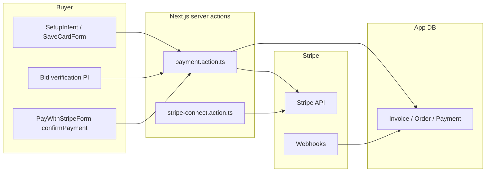

# Validate Stripe integration flow

## Architecture (high level)

## Required environment variables

| Variable | Role |
|----------|------|
| `STRIPE_SECRET_KEY` | Server SDK ([`src/lib/stripe.ts`](src/lib/stripe.ts)); without it most actions return “not configured”. |
| `NEXT_PUBLIC_STRIPE_PUBLISHABLE_KEY` | Stripe.js on client ([`SaveCardForm`](src/app/components/stripe/SaveCardForm.tsx), [`PayWithStripeForm`](src/app/components/stripe/PayWithStripeForm.tsx), [`BidConfirmCvcModal`](src/app/components/stripe/BidConfirmCvcModal.tsx)). |
| `STRIPE_WEBHOOK_SECRET` | Signature verification for [`POST /api/stripe/webhook`](src/app/api/stripe/webhook/route.ts); **webhook returns 500 if missing**. |
| `NEXT_PUBLIC_APP_URL` | `return_url` for [`PayWithStripeForm`](src/app/components/stripe/PayWithStripeForm.tsx) redirect after 3DS ([`pay/page.tsx`](src/app/(buyers)/buyers-dashboard/orders/[orderId]/pay/page.tsx)); fallback `http://localhost:3000` if unset (can break production redirects). |
| `PLATFORM_COMMISSION_PCT` (optional) | Seller payout math in [`transferToSellerForInvoice`](src/actions/stripe-connect.action.ts). |

**Validate:** In Stripe Dashboard (Test mode), confirm API keys match `.env.local` / deployment secrets and webhook endpoint URL matches your deployed host.

---

## Webhook contract (critical for “truth” in DB)

Handler: [`src/app/api/stripe/webhook/route.ts`](src/app/api/stripe/webhook/route.ts)

- **`payment_intent.succeeded`**: Requires `metadata.invoiceId` on the PaymentIntent. Then updates invoice/order/payment and calls **`transferToSellerForInvoice`**. Invoice [`triggerPaymentFlow`](src/actions/payment.action.ts) sets `metadata: { invoiceId }` — aligned.
- **Bid verification PIs** use `metadata.type: "bid_verification"` and **no** `invoiceId` — webhook hits `break` and does not touch invoices (correct).
- **`setup_intent.succeeded`**: Sets customer default payment method (duplicates client-side [`setDefaultPaymentMethodFromSetupIntent`](src/actions/payment.action.ts) / [`HandleSetupReturn`](src/app/components/stripe/HandleSetupReturn.tsx) — redundant but OK).

**Validate:**

1. Install Stripe CLI; forward events:  
   `stripe listen --forward-to localhost:3000/api/stripe/webhook`
2. Use the CLI-printed **signing secret** as `STRIPE_WEBHOOK_SECRET` locally (or Dashboard webhook secret for hosted env).
3. Trigger a test `payment_intent.succeeded` with `metadata[invoiceId]` matching a real pending invoice and confirm DB: invoice `PAID`, order `PAID`, `Payment` row, and Connect transfer when seller has `stripeConnectAccountId`.

---

## Flow 1: Save card (buyer)

- Server: [`createSetupIntent`](src/actions/payment.action.ts) → client [`SaveCardForm`](src/app/components/stripe/SaveCardForm.tsx) → `confirmSetup`.
- Return URL handling: [`HandleSetupReturn`](src/app/components/stripe/HandleSetupReturn.tsx) reads `setup_intent` + `redirect_status=succeeded`.

**Validate:** Complete card save in test mode; confirm Stripe Customer has default card (Dashboard) and `ensureBuyerHasValidCard` path succeeds for bidding.

---

## Flow 2: Bid verification (CVC / 3DS before bid)

- [`createBidVerificationIntent`](src/actions/payment.action.ts): `$0.50`, `capture_method: manual`, tied to existing card `payment_method`.
- Client: [`BidConfirmCvcModal`](src/app/components/stripe/BidConfirmCvcModal.tsx) → `confirmCardPayment`; then [`cancelBidVerification`](src/actions/payment.action.ts) cancels PI if appropriate.

**Validate:** Place bid flow with modal; in Stripe Dashboard confirm PI is canceled (no capture) for verification-only path per product rules.

---

## Flow 3: Pay invoice (buyer checkout UI)

- [`triggerPaymentFlow`](src/actions/payment.action.ts) creates/retrieves PI with `metadata.invoiceId`, stores `stripePaymentIntentId` on invoice.
- [`PayWithStripeForm`](src/app/components/stripe/PayWithStripeForm.tsx) loads client secret and uses **Payment Element** + `confirmPayment` (not Stripe Checkout).

**Validate:** Open [`/buyers-dashboard/orders/[orderId]/pay`](src/app/(buyers)/buyers-dashboard/orders/[orderId]/pay/page.tsx), pay with test card `4242…`; after success, webhook should mark paid and run seller transfer if Connect is set up.

---

## Flow 4: Off-session charge (lot close / cron)

- [`chargeInvoiceWithStoredPayment`](src/actions/payment.action.ts) confirms existing PI with default/first card; on success updates DB directly. Webhook may still fire; **seller payout** is intended to run from webhook ([comment in code](src/actions/payment.action.ts)) — `transferToSellerForInvoice` is idempotent via `sellerPayoutTransferId`.

**Validate:** Close a lot in test with a winning buyer who has a card; verify invoice moves to `PAID` and transfer record exists when seller is connected.

---

## Flow 5: Stripe Connect (seller)

- [`getOrCreateConnectAccount`](src/actions/stripe-connect.action.ts): Express, `US`, capabilities `card_payments` + `transfers`.
- [`createConnectAccountLink`](src/actions/stripe-connect.action.ts): onboarding links from seller UI ([`PayoutsConnectCard`](src/app/components/seller/PayoutsConnectCard.tsx)).
- Payout: [`transferToSellerForInvoice`](src/actions/stripe-connect.action.ts) after invoice is paid.

**Validate:** Complete Connect onboarding in test mode; pay an invoice; confirm `transfers` in Stripe Connect and `sellerPayoutTransferId` on invoice.

---

## Gaps / inconsistencies found (fix or accept explicitly)

1. **[`PayNowButton.tsx`](src/app/(buyers)/buyers-dashboard/orders/[orderId]/pay/PayNowButton.tsx)** — Mentions “Stripe Checkout” and does not navigate to Elements or pass `clientSecret`; **not imported anywhere else** (dead code). Real pay UX is **`PayWithStripeForm`** on the same feature’s `page.tsx`. Remove or align messaging if you revive the button.
2. **`triggerPaymentFlow`** when `STRIPE_SECRET_KEY` is unset returns `{ success: true }` without `clientSecret` ([`payment.action.ts`](src/actions/payment.action.ts) ~282–284) — UI may show generic errors; treat missing Stripe as explicit failure in QA checklists.
3. **Idempotency:** Concurrent webhook + `chargeInvoiceWithStoredPayment` success both update payment rows — acceptable if transactions are safe; watch for duplicate transfer attempts (mitigated by `sellerPayoutTransferId`).

---

## Suggested validation checklist (manual)

1. All env vars set; app boots without Stripe errors in server logs.
2. Webhook: CLI forward + test event or real payment → 200 from `/api/stripe/webhook`, invoice paid, transfer when applicable.
3. Buyer: save card → bid verification → place bid (product-specific).
4. Buyer: pay order page with `4242424242424242` → PAID + webhook + seller transfer.
5. Seller: Connect onboarding → receive test transfer.
6. Regression: payment fails / `payment_intent.payment_failed` logs (handler does not update invoice — by design).
